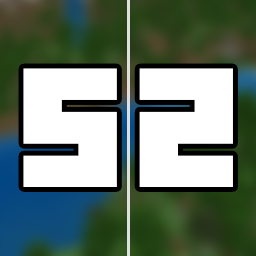

  

  <h3 align="center">Symmetry Mod</h3>

  
A mod created to make building in Minecraft easier.

  
Current Version: 1.18.2

## Table of contents

- [Quick start](#quick-start)
- [Status](#status)
- [Contributing](#contributing)
- [Creators](#creators)
- [Copyright and license](#copyright-and-license)

## Quick start

- Download Mod [JAR](https://github.com/AndrejStojkovic/Symmetry-Mod/releases/download/Releases/symmetry-1.0.jar) file.
- Put it in the 'mods' folder.
- Load game.

## Status

This mod is WIP and will be updated continously in the future.  
Things that are planned to be added: 3D Type of symmetry, Deleting one block and deleting all the other blocks in the symmetry and more...

## Commands list

| Command name | Usage | Description |
|--------------|-------|-------------|
| symmetry     | /symmetry   | Sets the position of the symmetry |
| symmetry set | /symmetry set (x) (y) (z)     | Sets the position of the symmetry using parameters |
| symmetry get | /symmetry get | Returns the 3D coordinates of the symmetry position |
| symmetry on  | /symmetry on | Enables symmetry building |
| symmetry off | /symmetry off | Disables symmetry building |
| symmetry type| /symmetry type (num) | Sets the type of symmetry for building. More info below |

### Type of Symmetry

| Type No. | Coordinate Axes | Preview |
|----------|-----------------|---------|
| 1 | X, Z | preview/img1.png |
| 2 | X, Z (Diagonal) | preview/img2.png |
| 3 | X | preview/img3.png |
| 4 | Z | preview/img4.png |
| WIP | X, Y, Z | preview/img5.png |
| WIP | X, Y, Z (Array) | preview/img6.png |

* Gold Block - Symmetry point

## Contributing

For contributing, make pull requests.

## Creators

**Andrej Stojkovikj** (Minecraft Name: **Devetka**)
- <https://github.com/AndrejStojkovic>

## Copyright and license

Code released under the [MIT License](https://github.com/AndrejStojkovic/Symmetry-Mod/blob/master/LICENSE).

Enjoy :metal:
